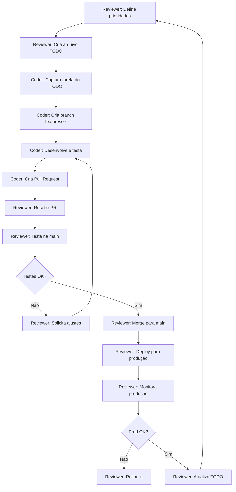

# Configuração de Ambientes WSL para Agentes Claude Code

## 📋 Índice

1. [Visão Geral](#visão-geral)
2. [Arquitetura do Sistema](#arquitetura-do-sistema)
3. [Por que Esta Solução?](#por-que-esta-solução)
4. [Estrutura dos Ambientes](#estrutura-dos-ambientes)
5. [Informações de Cada Agente](#informações-de-cada-agente)
6. [Acesso aos Serviços](#acesso-aos-serviços)
7. [Fluxo de Trabalho](#fluxo-de-trabalho)
8. [Comandos Úteis](#comandos-úteis)
9. [Troubleshooting](#troubleshooting)

---

## 🎯 Visão Geral

Este projeto utiliza **dois agentes Claude Code** trabalhando simultaneamente em ambientes completamente isolados via **WSL2 (Windows Subsystem for Linux)**. Cada agente possui:

- ✅ Sua própria distribuição Linux
- ✅ Sua própria conta Claude Code autenticada
- ✅ Seu próprio repositório Git clonado
- ✅ Seu próprio ambiente Docker isolado
- ✅ Suas próprias portas de rede

---

## 🏗️ Arquitetura do Sistema

```
Windows Host (48GB RAM)
│
├── WSL: Ubuntu-24.04-Coder
│   ├── Função: Desenvolvimento de Features
│   ├── Claude Code: Conta Coder
│   ├── Git Branch: feature/*
│   ├── Projeto: ~/projects/charhub-coder
│   ├── Docker Engine: Nativo (isolado)
│   └── Stack completa:
│       ├── PostgreSQL: porta 5432
│       ├── Redis: porta 6379
│       ├── Backend: porta 3000
│       ├── Frontend: porta 5173
│       ├── Nginx: porta 8080 (HTTP) / 8443 (HTTPS)
│       └── Cloudflared
│
└── WSL: Ubuntu-22.04-Reviewer
    ├── Função: Revisão, Testes e Deploy
    ├── Claude Code: Conta Reviewer
    ├── Git Branch: main
    ├── Projeto: ~/projects/charhub-reviewer
    ├── Docker Engine: Nativo (isolado)
    └── Stack completa:
        ├── PostgreSQL: porta 5433
        ├── Redis: porta 6380
        ├── Backend: porta 3001
        ├── Frontend: porta 5174
        ├── Nginx: porta 8081 (HTTP) / 8444 (HTTPS)
        └── Cloudflared
```

---

## 💡 Por que Esta Solução?

### **Problema a Resolver**

Precisávamos de dois agentes Claude Code trabalhando simultaneamente:
1. **Agente Coder**: Desenvolve features em branches separadas
2. **Agente Reviewer**: Revisa, testa e faz deploy da branch main

### **Desafios Enfrentados**

1. **Conflito de Contas**: Não é possível ter duas contas Claude Code autenticadas simultaneamente no mesmo ambiente
2. **Conflito de Portas**: Dois ambientes Docker não podem usar as mesmas portas
3. **Isolamento de Dados**: Cada agente precisa de seu próprio banco de dados e estado da aplicação
4. **Performance**: Precisa rodar ambos simultaneamente sem degradação

### **Soluções Consideradas**

| Solução | Vantagens | Desvantagens | Escolhida? |
|---------|-----------|--------------|------------|
| **Máquinas Virtuais** | Isolamento total | Pesado (4-8GB RAM cada), lento | ❌ Não |
| **Docker Containers** | Leve, reproduzível | Claude Code CLI com limitações em containers | ❌ Não |
| **WSL2 Compartilhado** | Simples | Conflito de contas e configurações | ❌ Não |
| **WSL2 Múltiplas Distribuições** | Leve, isolado, performance nativa | Requer configuração inicial | ✅ **SIM** |

### **Por que WSL2 com Múltiplas Distribuições?**

✅ **Isolamento Completo**: Cada WSL é um ambiente Linux independente  
✅ **Performance Nativa**: Quase mesma velocidade que Linux nativo  
✅ **Leve**: ~2GB RAM por WSL vs 4-8GB por VM  
✅ **Docker Nativo**: Cada WSL tem seu próprio Docker Engine  
✅ **Fácil Acesso**: Integração perfeita com Windows e VS Code  
✅ **Escalável**: Fácil adicionar mais agentes no futuro  
✅ **Mesmas Configurações**: Um único `docker-compose.yml` reutilizado  

---

## 📂 Estrutura dos Ambientes

### **Distribuições WSL Instaladas**

```powershell
# Listar distribuições
wsl --list --verbose

# Saída esperada:
#   NAME                     STATE           VERSION
# * Ubuntu-24.04-Coder       Running         2
#   Ubuntu-22.04-Reviewer    Running         2
#   docker-desktop           Running         2
```

### **Estrutura de Arquivos em Cada WSL**

**WSL Coder (Ubuntu-24.04-Coder):**
```
/home/root/
├── .bashrc                      # Configurações do shell
├── .config/claude/              # Credenciais Claude Code (Conta Coder)
└── projects/
    └── charhub-coder/
        ├── docker-compose.yml
        ├── docker-compose.override.yml  # Portas customizadas
        ├── .env
        ├── backend/
        ├── frontend/
        ├── nginx/
        └── cloudflared/
```

**WSL Reviewer (Ubuntu-22.04-Reviewer):**
```
/home/root/
├── .bashrc
├── .config/claude/              # Credenciais Claude Code (Conta Reviewer)
└── projects/
    └── charhub-reviewer/
        ├── docker-compose.yml
        ├── docker-compose.override.yml  # Portas diferentes do Coder
        ├── .env
        ├── backend/
        ├── frontend/
        ├── nginx/
        └── cloudflared/
```

---

## 🤖 Informações de Cada Agente

### **Agente Coder (Ubuntu-24.04-Coder)**

**Localização:**
- **WSL:** `Ubuntu-24.04-Coder`
- **Diretório:** `~/projects/charhub-coder`
- **Acesso Windows:** `\\wsl.localhost\Ubuntu-24.04-Coder\home\root\projects\charhub-coder`

**Responsabilidades:**
- Capturar tarefas priorizadas da lista de TODO
- Desenvolver features em branches separadas (`feature/*`)
- Escrever código, implementar funcionalidades
- Testar localmente no ambiente de desenvolvimento
- Criar Pull Requests detalhados ao finalizar
- **NÃO trabalha na branch main**

**Ambiente:**
- **Branch Git:** `feature/*` (sempre em branch separada)
- **Conta Claude:** Coder
- **Portas de Acesso:**
  - Nginx (HTTP): `http://localhost:8080`
  - Nginx (HTTPS): `https://localhost:8443`
  - Backend API: `http://localhost:3000`
  - Frontend Dev: `http://localhost:5173`
  - PostgreSQL: `localhost:5432`
  - Redis: `localhost:6379`

**Comando de Início:**
```bash
wsl -d Ubuntu-24.04-Coder
cd ~/projects/charhub-coder
docker compose up -d
claude
```

---

### **Agente Reviewer (Ubuntu-22.04-Reviewer)**

**Localização:**
- **WSL:** `Ubuntu-22.04-Reviewer`
- **Diretório:** `~/projects/charhub-reviewer`
- **Acesso Windows:** `\\wsl.localhost\Ubuntu-22.04-Reviewer\home\root\projects\charhub-reviewer`

**Responsabilidades:**
- Definir prioridades de desenvolvimento
- Receber e revisar Pull Requests
- Mergear com main e rodar testes básicos
- Realizar ajustes de compatibilidade
- Escrever documentação de features
- Atualizar/remover arquivos TODO
- Escrever testes automatizados
- Fazer deploy via GitHub Actions
- Monitorar produção e fazer rollback se necessário
- Executar scripts de migração quando necessário
- Coletar métricas e propor melhorias
- **Trabalha APENAS na branch main**

**Ambiente:**
- **Branch Git:** `main` (sempre)
- **Conta Claude:** Reviewer
- **Portas de Acesso:**
  - Nginx (HTTP): `http://localhost:8081`
  - Nginx (HTTPS): `https://localhost:8444`
  - Backend API: `http://localhost:3001`
  - Frontend Dev: `http://localhost:5174`
  - PostgreSQL: `localhost:5433`
  - Redis: `localhost:6380`

**Comando de Início:**
```bash
wsl -d Ubuntu-22.04-Reviewer
cd ~/projects/charhub-reviewer
docker compose up -d
claude
```

---

## 🌐 Acesso aos Serviços

### **Do Windows (Navegador)**

| Serviço | Coder | Reviewer |
|---------|-------|----------|
| **Aplicação (HTTP)** | http://localhost:8080 | http://localhost:8081 |
| **Aplicação (HTTPS)** | https://localhost:8443 | https://localhost:8444 |
| **Backend API** | http://localhost:3000 | http://localhost:3001 |
| **Frontend Dev** | http://localhost:5173 | http://localhost:5174 |

### **Ferramentas de Banco de Dados**

**PostgreSQL:**
- **Coder:** `localhost:5432`
- **Reviewer:** `localhost:5433`
- **Usuário/Senha:** Configurados no `.env`

**Redis:**
- **Coder:** `localhost:6379`
- **Reviewer:** `localhost:6380`

### **VS Code Remote**

Abrir projetos no VS Code do Windows:

```bash
# Para Coder
wsl -d Ubuntu-24.04-Coder
cd ~/projects/charhub-coder
code .

# Para Reviewer
wsl -d Ubuntu-22.04-Reviewer
cd ~/projects/charhub-reviewer
code .
```

---

## 🔄 Fluxo de Trabalho

### **Ciclo Completo de Desenvolvimento**



### **Exemplo Prático**

**1. Reviewer (Main Branch):**
```bash
# Define nova feature no TODO
echo "## Feature: Sistema de notificações" > docs/todo/notifications.md

# Aguarda o Coder desenvolver
```

**2. Coder (Feature Branch):**
```bash
# Captura tarefa
cd ~/projects/charhub-coder
git checkout -b feature/notifications

# Desenvolve
claude
# "Implementar sistema de notificações conforme docs/todo/notifications.md"

# Testa
docker compose up -d
# Testa em http://localhost:8080

# Finaliza
git add .
git commit -m "feat: implementa sistema de notificações"
git push origin feature/notifications

# Cria PR via GitHub
```

**3. Reviewer (Main Branch):**
```bash
# Recebe PR
cd ~/projects/charhub-reviewer
git fetch origin
git checkout feature/notifications

# Testa
docker compose down
docker compose up -d
# Testa em http://localhost:8081

# Se OK, merge
git checkout main
git merge feature/notifications
git push origin main

# Deploy automático via GitHub Actions
# Monitora logs de produção
```

---

## 🛠️ Comandos Úteis

### **Gerenciamento de WSL**

```powershell
# Listar distribuições
wsl --list --verbose

# Entrar em um WSL específico
wsl -d Ubuntu-24.04-Coder
wsl -d Ubuntu-22.04-Reviewer

# Parar um WSL
wsl --terminate Ubuntu-24.04-Coder
wsl --terminate Ubuntu-22.04-Reviewer

# Parar todos os WSL
wsl --shutdown

# Ver uso de recursos
wsl --list --running
```

### **Docker em Cada WSL**

```bash
# Iniciar Docker (se não iniciou automaticamente)
sudo service docker start

# Ver status
sudo service docker status

# Subir containers
docker compose up -d

# Ver containers rodando
docker compose ps

# Ver logs
docker compose logs -f

# Parar containers
docker compose down

# Reconstruir containers
docker compose up -d --build

# Limpar tudo
docker compose down -v  # Remove volumes também
```

### **Git em Cada WSL**

```bash
# Ver branch atual
git branch

# Coder: Criar nova feature
git checkout -b feature/nome-da-feature

# Reviewer: Voltar para main
git checkout main
git pull origin main

# Ver status
git status

# Ver diferenças
git diff

# Histórico
git log --oneline --graph
```

### **Claude Code**

```bash
# Iniciar Claude Code
claude

# Dentro do Claude Code:
# /login      - Fazer login (já feito)
# /logout     - Fazer logout
# /settings   - Ver configurações
# /help       - Ajuda
# Ctrl+C      - Sair
```

---

## 🐛 Troubleshooting

### **Claude Code não inicia**

```bash
# Verificar se está autenticado
claude --version

# Reautenticar
claude
# Digite: /login
```

### **Docker não inicia**

```bash
# Iniciar manualmente
sudo service docker start

# Ver status
sudo service docker status

# Ver logs de erro
sudo journalctl -u docker
```

### **Porta já em uso**

```bash
# Ver o que está usando a porta
sudo netstat -tulpn | grep :8080

# Parar containers
docker compose down

# Verificar se portas estão liberadas
sudo lsof -i :8080
```

### **WSL não responde**

```powershell
# No PowerShell Windows
wsl --shutdown
wsl -d Ubuntu-24.04-Coder
```

### **IP do WSL mudou**

Os IPs dos WSL são dinâmicos. Use sempre `localhost` com as portas específicas:
- Coder: `localhost:8080`
- Reviewer: `localhost:8081`

### **Containers não se comunicam**

Verifique se estão na mesma rede Docker:

```bash
docker network ls
docker compose ps
```

### **Falta de espaço em disco**

```bash
# Limpar containers parados
docker system prune -a

# Limpar volumes não usados
docker volume prune

# Ver uso de disco
docker system df
```

### **Performance lenta**

```bash
# Ver uso de recursos
docker stats

# Limitar recursos no .wslconfig (Windows)
# C:\Users\Leandro\.wslconfig
```

---

## 📚 Recursos Adicionais

### **Documentação Oficial**

- [WSL2 Documentation](https://docs.microsoft.com/en-us/windows/wsl/)
- [Docker Compose Documentation](https://docs.docker.com/compose/)
- [Claude Code Documentation](https://docs.claude.com/claude-code)

### **Arquivos de Configuração Importantes**

- **Windows:** `C:\Users\Leandro\.wslconfig` - Limites de recursos WSL
- **Cada WSL:** `~/.bashrc` - Configurações do shell
- **Cada WSL:** `~/.config/claude/` - Credenciais Claude Code
- **Cada Projeto:** `docker-compose.yml` - Configuração base
- **Cada Projeto:** `docker-compose.override.yml` - Portas customizadas
- **Cada Projeto:** `.env` - Variáveis de ambiente

---

## ✅ Checklist de Verificação

Use este checklist para garantir que tudo está funcionando:

### **Ambiente Coder**
- [ ] WSL Ubuntu-24.04-Coder está rodando
- [ ] Claude Code autenticado com conta Coder
- [ ] Repositório clonado em `~/projects/charhub-coder`
- [ ] Docker Engine rodando
- [ ] Containers sobem sem erro (`docker compose up -d`)
- [ ] Aplicação acessível em `http://localhost:8080`
- [ ] Git configurado (branch `feature/*`)

### **Ambiente Reviewer**
- [ ] WSL Ubuntu-22.04-Reviewer está rodando
- [ ] Claude Code autenticado com conta Reviewer
- [ ] Repositório clonado em `~/projects/charhub-reviewer`
- [ ] Docker Engine rodando
- [ ] Containers sobem sem erro (`docker compose up -d`)
- [ ] Aplicação acessível em `http://localhost:8081`
- [ ] Git configurado (branch `main`)

### **Integração**
- [ ] Ambos os agentes rodam simultaneamente
- [ ] Sem conflito de portas
- [ ] VS Code Remote funciona em ambos
- [ ] Comunicação Git/GitHub funciona

---

## 🎯 Conclusão

Esta configuração oferece:
- ✅ **Isolamento total** entre agentes
- ✅ **Performance nativa** do Linux
- ✅ **Escalabilidade** para adicionar mais agentes
- ✅ **Facilidade de manutenção** com configurações padronizadas
- ✅ **Integração perfeita** com ferramentas Windows (VS Code, navegador)

Cada agente trabalha em seu próprio mundo, sem interferir no outro, permitindo desenvolvimento paralelo eficiente e seguro.

---

**Última atualização:** 30 de Novembro de 2025  
**Versão:** 1.0  
**Responsável:** Leandro