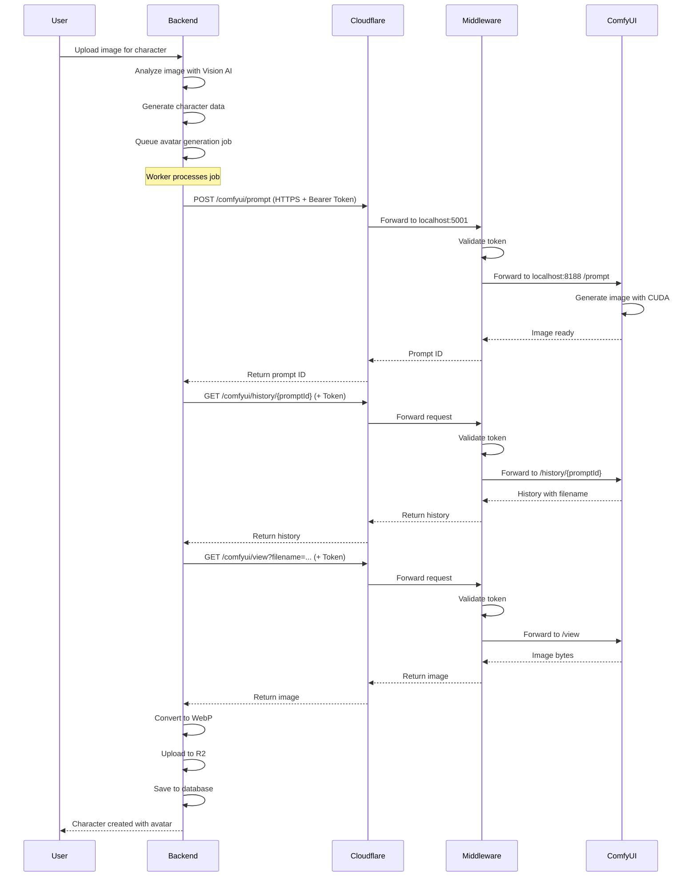

# ComfyUI Setup com Middleware e Cloudflare Tunnel

Este documento descreve a configuração do ComfyUI para geração de imagens no CharHub, utilizando um Middleware Node.js para segurança e Cloudflare Tunnel para exposição pública.

## Arquitetura

```
┌─────────────────┐
│  CharHub Backend│
│   (Docker/WSL)  │
│                 │
│  COMFYUI_URL=   │
│  https://...    │
│  + Auth Token   │
└────────┬────────┘
         │
         │ HTTPS + Bearer Token
         ▼
┌─────────────────┐
│ Cloudflare      │
│ Tunnel          │
│ (cloudflared)   │
└────────┬────────┘
         │
         │ HTTP
         ▼
┌─────────────────┐
│ ComfyUI         │
│ Middleware      │
│ (Node.js)       │
│ Port 5001       │
│                 │
│ - Auth Layer    │
│ - Proxy Routes  │
│ - Batch Support │
└────────┬────────┘
         │
         │ HTTP (internal)
         ▼
┌─────────────────┐
│ ComfyUI         │
│ Windows Native  │
│ localhost:8188  │
│                 │
│ RTX 3060 TI     │
│ CUDA 12.8       │
└─────────────────┘
```

## Por que essa arquitetura?

### 1. **Performance GPU**
- ComfyUI roda nativamente no Windows para máximo desempenho
- Acesso direto à GPU RTX 3060 TI sem overhead de virtualização
- CUDA 12.8 funciona melhor no Windows nativo

### 2. **Segurança**
- **Middleware com autenticação obrigatória** via Bearer Token
- ComfyUI não fica exposto diretamente na internet
- Cloudflare fornece SSL/TLS e proteção DDoS

### 3. **Flexibilidade e Features**
- Proxy transparente para endpoints nativos do ComfyUI
- Suporte para batch de imagens de referência
- Endpoint `/middleware/generate` para workflows avançados
- Mesmo endpoint funciona para dev e produção

## Configuração Atual

### Endpoint Público
```
https://comfyui.charhub.app
```

Este endpoint está configurado via Cloudflare Tunnel e:
- ✅ Funciona para desenvolvimento local (backend em Docker/WSL)
- ✅ Funciona para produção (backend em servidor remoto)
- ✅ SSL/TLS automático via Cloudflare
- ✅ Sem necessidade de expor porta 8188 diretamente

### Variáveis de Ambiente

**`.env`**:
```bash
# ComfyUI Middleware endpoint via Cloudflare Tunnel
COMFYUI_URL=https://comfyui.charhub.app

# Required: Authentication token for middleware
# Must match the token configured in the middleware server
COMFYUI_SERVICE_TOKEN=afa7b173c465ba2d84beb3a874d03d3f659d47cd01404c49b256a5dab4cb69ad

# Timeout for image generation (5 minutes)
COMFYUI_TIMEOUT=300000
```

> **⚠️ IMPORTANTE**: O `COMFYUI_SERVICE_TOKEN` é **obrigatório** e deve corresponder ao token configurado no servidor middleware.

### Opções de Configuração

| Ambiente | URL Recomendada | Quando Usar |
|----------|-----------------|-------------|
| **Produção** | `https://comfyui.charhub.app` | Sempre (padrão atual) |
| **Dev (Docker/WSL)** | `https://comfyui.charhub.app` | Backend em container precisa acessar ComfyUI no Windows |
| **Dev (Native)** | `http://localhost:8188` | Apenas se backend e ComfyUI estão na mesma máquina sem Docker |

## Como Funciona

### 1. ComfyUI (Windows Native)
- Roda em `http://localhost:8188`
- Acesso direto à GPU RTX 3060 TI
- Processamento de workflows para geração de imagens
- **Não exposto diretamente** - apenas acessível localmente

### 2. ComfyUI Middleware (Node.js)
- Roda em `http://localhost:5001`
- **Camada de autenticação**: Valida Bearer Token em todas as requisições
- **Proxy transparente**: Encaminha requisições para ComfyUI com prefixo `/comfyui/`
  - `/comfyui/prompt` → ComfyUI `/prompt`
  - `/comfyui/history/{id}` → ComfyUI `/history/{id}`
  - `/comfyui/view` → ComfyUI `/view`
  - `/comfyui/upload/image` → ComfyUI `/upload/image`
  - `/comfyui/system_stats` → ComfyUI `/system_stats`
- **Batch support**: Endpoint `/middleware/generate` para workflows com múltiplas imagens

### 3. Cloudflare Tunnel (Windows)
- Conecta `localhost:5001` → `https://comfyui.charhub.app`
- Fornece SSL/TLS automático
- Torna o middleware acessível pela internet de forma segura

### 4. CharHub Backend (Docker/WSL ou Servidor)
- Acessa `https://comfyui.charhub.app` via HTTPS
- Envia header `Authorization: Bearer <token>` em todas as requisições
- Usa endpoints proxy: `/comfyui/prompt`, `/comfyui/history`, etc.
- Recebe imagens geradas

## Fluxo de Geração de Imagem



## Requisitos

### Hardware
- GPU Nvidia RTX 3060 TI (ou superior)
- CUDA 12.8 instalado
- Mínimo 12GB VRAM (recomendado para modelos SDXL)

### Software
- **Windows**: ComfyUI + ComfyUI Middleware (Node.js) + cloudflared + CUDA drivers
- **Backend**: Docker + WSL2 (ou servidor Linux remoto)

## Troubleshooting

### Backend não conecta ao ComfyUI

**Sintoma**: `ECONNREFUSED` ou timeout nos logs

**Soluções**:

1. **Verificar ComfyUI está rodando**:
   ```powershell
   # No Windows, verificar se ComfyUI está acessível
   curl http://localhost:8188
   ```

2. **Verificar Cloudflare Tunnel está ativo**:
   ```powershell
   # Deve estar rodando em processo separado
   cloudflared tunnel --config <caminho>/config.yml run
   ```

3. **Testar endpoint público**:
   ```bash
   curl https://comfyui.charhub.app
   ```

4. **Verificar variável de ambiente no backend**:
   ```bash
   docker compose exec backend env | grep COMFYUI_URL
   # Deve retornar: COMFYUI_URL=https://comfyui.charhub.app
   ```

### ComfyUI está lento

**Causas possíveis**:
- Modelo muito grande para 12GB VRAM
- Múltiplas gerações em paralelo
- GPU em uso por outro processo

**Soluções**:
- Ajustar concurrency do worker para 1 (já configurado)
- Monitorar uso de VRAM: `nvidia-smi`
- Usar modelos otimizados para RTX 3060

### Cloudflare Tunnel desconecta

**Sintoma**: Tunnel para de funcionar periodicamente

**Soluções**:
- Configurar cloudflared como serviço do Windows
- Verificar logs: `cloudflared tunnel --config <config> run --loglevel debug`
- Atualizar cloudflared para versão mais recente

## Futuro: Migração para Servidor GPU Dedicado

Quando migrar para servidor GPU dedicado:

1. **Instalar ComfyUI no servidor**
2. **Configurar novo túnel Cloudflare** (ou usar mesmo)
3. **Atualizar DNS** se necessário
4. **Não precisa mudar código do backend** - apenas a variável `COMFYUI_URL`

Exemplo:
```bash
# .env no servidor GPU
COMFYUI_URL=https://comfyui.charhub.app  # Mesmo endpoint!
```

## Segurança

### Autenticação (Obrigatória)

O middleware implementa autenticação obrigatória via Bearer Token:

1. **Token já configurado**: `afa7b173c465ba2d84beb3a874d03d3f659d47cd01404c49b256a5dab4cb69ad`

2. **Configuração no Backend**:
   ```bash
   # .env e .env.production
   COMFYUI_SERVICE_TOKEN=afa7b173c465ba2d84beb3a874d03d3f659d47cd01404c49b256a5dab4cb69ad
   ```

3. **Configuração no Middleware**: O mesmo token deve estar configurado no arquivo `.env` do middleware server

4. **Como funciona**:
   - O backend adiciona automaticamente o header `Authorization: Bearer <token>` em todas as requisições
   - O middleware valida o token antes de encaminhar para o ComfyUI
   - Requisições sem token ou com token inválido são rejeitadas com HTTP 401

### Rotação de Token

Para trocar o token de autenticação:

1. **Gerar novo token**:
   ```bash
   openssl rand -hex 32
   ```

2. **Atualizar no middleware** (servidor Windows):
   - Editar `.env` no servidor middleware
   - Reiniciar o middleware

3. **Atualizar no backend** (CharHub):
   - Editar `.env` e `.env.production`
   - Reiniciar o backend: `docker compose restart backend`

### Cloudflare Access (Avançado)

Para proteção adicional em camadas, pode-se configurar Cloudflare Access para exigir autenticação adicional no túnel.

## Monitoramento

### Logs do Backend
```bash
# Ver logs de geração de imagem
docker compose logs backend | grep -E "ComfyUI|avatar_generation|image_generation"

# Verificar se o token está configurado
docker compose logs backend | grep "ComfyUI Service Token configured"
```

### Logs do Middleware
```powershell
# Windows PowerShell (na pasta do middleware)
# Se rodando via script start-all-services.ps1, já abre janela com logs
# Ou verificar diretamente:
cd comfyui-middleware
npm run dev
```

### Logs do ComfyUI
- Interface web: `http://localhost:8188` (no Windows)
- Console do processo Python
- Verificar geração de imagens em tempo real

### Logs do Cloudflare Tunnel
```powershell
# Windows PowerShell
cloudflared tunnel --config <config> run --loglevel info
```

## Referências

- [ComfyUI GitHub](https://github.com/comfyanonymous/ComfyUI)
- [ComfyUI Middleware](https://github.com/leandro-br-dev/charhub-comfyui) - Repositório do middleware
- [Cloudflare Tunnel Docs](https://developers.cloudflare.com/cloudflare-one/connections/connect-apps/)
- [CUDA 12.8 Release Notes](https://docs.nvidia.com/cuda/cuda-toolkit-release-notes/)
