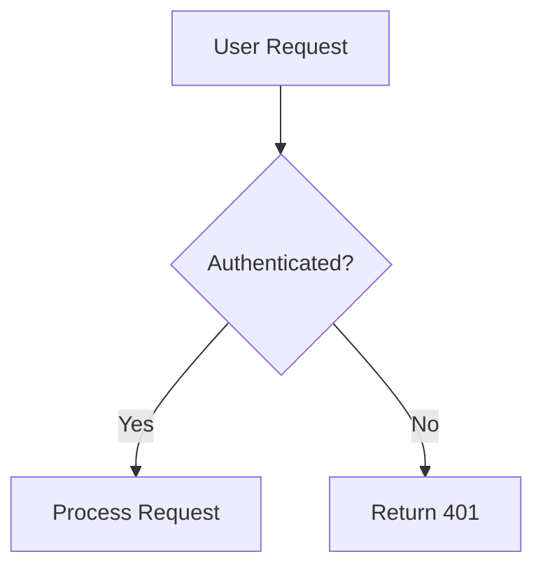

# Documentation Standards

**Last Updated**: 2025-12-08
**Applies to**: All documentation in `docs/`

---

## 📋 Overview

CharHub documentation follows the **Diátaxis Framework** - a systematic approach to technical documentation that divides content into four types:

1. **Tutorials** (learning-oriented)
2. **How-To Guides** (problem-oriented)
3. **Reference** (information-oriented)
4. **Explanation** (understanding-oriented)

---

## 🎯 Diátaxis Framework

### Documentation Types

| Type | Purpose | User Need | Location |
|------|---------|-----------|----------|
| **Tutorial** | Learning by doing | "I want to learn" | `docs/01-tutorials/` |
| **How-To Guide** | Solve a specific problem | "I need to do X" | `docs/02-guides/` |
| **Reference** | Precise information | "I need to look up X" | `docs/03-reference/` |
| **Explanation** | Understanding concepts | "I want to understand" | `docs/04-architecture/` |

### When to Use Each Type

#### 1. Tutorial (Learning-Oriented)

**Purpose**: Teach a beginner by walking through a complete example

**Characteristics**:
- Learning-focused (not goal-focused)
- Complete, working example
- Step-by-step instructions
- Explains what's happening as you go

**Example**:
```markdown
# Tutorial: Creating Your First Character

## What You'll Learn
- How to create a character
- How to add personality traits
- How to start a conversation

## Prerequisites
- CharHub account
- Basic understanding of...

## Step 1: Create Character
1. Click "Create Character" button
2. Enter character name: "Alex"
3. Add description: "A friendly AI assistant"

Now you've created your first character! Let's add personality...

## Step 2: Add Personality
...
```

#### 2. How-To Guide (Problem-Oriented)

**Purpose**: Show how to solve a specific real-world problem

**Characteristics**:
- Goal-focused (solve specific problem)
- Assumes some knowledge
- Series of steps to achieve goal
- Practical, not comprehensive

**Example**:
```markdown
# How to Add Rate Limiting to an Endpoint

## Prerequisites
- Existing API endpoint
- Redis configured

## Steps

### 1. Install Dependencies
\```bash
npm install express-rate-limit
\```

### 2. Configure Rate Limiter
\```typescript
import rateLimit from 'express-rate-limit';

const limiter = rateLimit({
  windowMs: 60 * 1000,  // 1 minute
  max: 10               // 10 requests per minute
});
\```

### 3. Apply to Route
\```typescript
router.post('/api/chat', limiter, chatHandler);
\```

## Verification
Test that rate limiting works:
\```bash
# Send 11 requests - last one should fail
for i in {1..11}; do curl -X POST http://localhost:3001/api/chat; done
\```
```

#### 3. Reference (Information-Oriented)

**Purpose**: Provide precise, technical information

**Characteristics**:
- Comprehensive coverage
- Dry, factual tone
- Organized for quick lookup
- No explanation or teaching

**Example**:
```markdown
# Credits API Reference

## Endpoints

### GET /api/v1/credits/balance

Returns user's current credit balance.

**Authentication**: Required

**Parameters**: None

**Response**:
\```json
{
  "balance": 200,
  "lastUpdated": "2025-12-08T10:30:00Z"
}
\```

**Status Codes**:
- 200: Success
- 401: Unauthorized
- 500: Server error

### POST /api/v1/credits/deduct

Deducts credits from user balance.

**Authentication**: Required

**Request Body**:
\```json
{
  "amount": 10,
  "reason": "CHAT_MESSAGE",
  "metadata": {
    "messageId": "msg_123"
  }
}
\```

**Response**:
\```json
{
  "newBalance": 190,
  "transactionId": "txn_456"
}
\```

**Status Codes**:
- 200: Success
- 400: Invalid request
- 402: Insufficient credits
- 500: Server error
```

#### 4. Explanation (Understanding-Oriented)

**Purpose**: Clarify and illuminate a topic

**Characteristics**:
- Understanding-focused
- Provides context and background
- Discusses alternatives and trade-offs
- May include history and design decisions

**Example**:
```markdown
# Architecture Decision: Multi-User Chat

## Context
CharHub initially supported only 1-on-1 conversations between user and AI character. Users requested ability to invite friends to chat sessions.

## Decision
Implement multi-user chat using membership-based access control.

## Alternatives Considered

### Option 1: Group Ownership Model
**Pros**: Simple ownership
**Cons**: No fine-grained permissions

### Option 2: Membership with Roles (Chosen)
**Pros**: Flexible permissions, scalable
**Cons**: More complex implementation

## Implementation
We chose Option 2 because:
- Supports future features (moderators, read-only members)
- Aligns with industry standards (Slack, Discord)
- Provides better user experience

## Trade-offs
- Complexity: Added ~500 lines of code
- Performance: Additional database queries for permission checks
- Flexibility: Worth the complexity for long-term growth
```

---

## 📝 Markdown Standards

### Headers

```markdown
# Document Title (H1 - Only one per document)

## Main Section (H2)

### Subsection (H3)

#### Detail (H4)

##### Rarely Needed (H5)

###### Almost Never Used (H6)
```

**Rules**:
- Use ATX-style headers (`#`) not Setext (`===` or `---`)
- One H1 per document
- Don't skip levels (H2 → H4)
- Leave blank line before and after headers

### Code Blocks

````markdown
```typescript
// Always specify language
function example() {
  return "Hello";
}
```

```bash
# For shell commands
npm install
docker compose up
```

```json
{
  "key": "value"
}
```
````

### Lists

```markdown
## Unordered Lists
- Item 1
- Item 2
  - Nested item (2 spaces indentation)
  - Another nested item
- Item 3

## Ordered Lists
1. First step
2. Second step
   1. Nested step (3 spaces indentation)
   2. Another nested step
3. Third step

## Task Lists
- [x] Completed task
- [ ] Pending task
- [ ] Another pending task
```

### Links

```markdown
<!-- ✅ Good - Relative links for internal docs -->
[System Overview](../04-architecture/system-overview.md)
[README](./README.md)

<!-- ✅ Good - Absolute URLs for external links -->
[TypeScript Docs](https://www.typescriptlang.org/)

<!-- ❌ Bad - Absolute paths for internal docs -->
[README](/docs/README.md)

<!-- ❌ Bad - Missing link text -->
[Click here](./file.md)
```

### Tables

```markdown
| Header 1 | Header 2 | Header 3 |
|----------|----------|----------|
| Cell 1   | Cell 2   | Cell 3   |
| Cell 4   | Cell 5   | Cell 6   |

<!-- Alignment -->
| Left | Center | Right |
|:-----|:------:|------:|
| L    | C      | R     |
```

### Emphasis

```markdown
**Bold** for strong emphasis
*Italic* for slight emphasis
`Code` for inline code

<!-- ✅ Good usage -->
The `userId` parameter is **required**.

<!-- ❌ Bad - Overuse -->
This is a **very important** document with **many bold words**.
```

### Blockquotes

```markdown
> **Note**: This is an important note.

> **Warning**: This action cannot be undone.

> **Tip**: You can use keyboard shortcut Ctrl+S.
```

### Horizontal Rules

```markdown
---

Use `---` (three dashes) for horizontal rules.
Leave blank lines before and after.
```

---

## 📂 File Organization

### Naming Conventions

```
README.md                  ✅ Main entry point for folder
system-overview.md         ✅ Kebab-case for docs
backup-restore-guide.md    ✅ Descriptive names
setup.md                   ⚠️ Too generic (prefer detailed-setup-guide.md)
doc1.md                    ❌ Non-descriptive
```

### Folder Structure

```
docs/
├── README.md                    # Main entry point
├── 01-tutorials/
│   └── getting-started.md
├── 02-guides/
│   ├── development/
│   │   └── local-setup.md
│   └── deployment/
│       └── production-deploy.md
├── 03-reference/
│   ├── backend/
│   │   ├── README.md
│   │   └── credits-guide.md
│   └── api/
│       └── llm-providers.md
└── 04-architecture/
    └── system-overview.md
```

---

## 🎨 Document Structure

### Template

```markdown
# Document Title

**Last Updated**: YYYY-MM-DD
**Status**: Active | Draft | Deprecated
**For**: Target audience

---

## 📋 Overview

Brief 1-2 sentence description of document purpose.

---

## [Main Content Sections]

### Section 1

Content...

### Section 2

Content...

---

## 🔗 Related Documents

**Prerequisites**:
- [Doc 1](./doc1.md)
- [Doc 2](./doc2.md)

**Next Steps**:
- [Doc 3](./doc3.md)

---

[← Back to Parent](./README.md) | [← Back to Documentation Home](../README.md)
```

### Front Matter

All documents should include:

```markdown
# Document Title

**Last Updated**: 2025-12-08
**Status**: Active
**For**: Developers, Contributors, Operators
**Difficulty**: Beginner, Intermediate, Advanced

---
```

### Navigation Footer

All documents should include navigation:

```markdown
---

[← Back to Parent Section](./README.md) | [← Back to Documentation Home](../README.md)
```

---

## ✍️ Writing Style

### Tone

- **Clear and concise** - Use simple words
- **Active voice** - "Run the command" not "The command should be run"
- **Present tense** - "The system uses" not "The system will use"
- **Direct** - "You must configure" not "One should configure"

### Examples

```markdown
<!-- ✅ Good - Clear, active, direct -->
Configure the environment variables before starting the server.

<!-- ❌ Bad - Passive, wordy -->
The environment variables should be configured by the developer before the server is started.

<!-- ✅ Good - Present tense -->
The system validates user input using Zod schemas.

<!-- ❌ Bad - Future tense -->
The system will validate user input using Zod schemas.
```

### Audience Awareness

```markdown
<!-- For beginners -->
## Prerequisites
- Basic knowledge of TypeScript
- Node.js 18+ installed
- Familiarity with REST APIs

<!-- For advanced users -->
## Prerequisites
- Experience with Docker
- Understanding of OAuth 2.0 flow
- Knowledge of PostgreSQL
```

---

## 📸 Visual Elements

### Screenshots

When to include:
- ✅ UI changes or new features
- ✅ Complex workflows
- ✅ Error messages or debugging
- ❌ Simple text-based instructions
- ❌ API responses (use code blocks instead)

Format:
```markdown


*Figure 1: Dashboard showing user statistics*
```

### Diagrams

Use Mermaid or ASCII diagrams:

````markdown


```
┌─────────────┐
│   Frontend  │
└──────┬──────┘
       │ HTTP
       ▼
┌─────────────┐
│   Backend   │
└──────┬──────┘
       │ SQL
       ▼
┌─────────────┐
│  Database   │
└─────────────┘
```
````

---

## 🔍 Documentation Checklist

Before submitting documentation:

- [ ] **Accuracy**: All information is correct and up-to-date
- [ ] **Completeness**: Covers all necessary information
- [ ] **Clarity**: Easy to understand for target audience
- [ ] **Structure**: Follows Diátaxis framework
- [ ] **Navigation**: Includes links to related docs
- [ ] **Examples**: Includes code examples where helpful
- [ ] **Grammar**: No spelling or grammar errors
- [ ] **Links**: All links work (relative paths for internal docs)
- [ ] **Code blocks**: All code blocks have language specified
- [ ] **Front matter**: Includes Last Updated, Status, For
- [ ] **Footer**: Includes navigation links

---

## 🚫 Common Mistakes

### 1. Wrong Documentation Type

```markdown
<!-- ❌ Bad - Tutorial trying to be reference -->
# Tutorial: Chat API

## POST /api/v1/chat/send
Authentication: Required
Parameters: ...

<!-- ✅ Good - Tutorial focused on learning -->
# Tutorial: Building Your First Chatbot

In this tutorial, you'll learn how to create a chatbot by:
1. Creating a character
2. Sending your first message
3. Handling responses
```

### 2. Unclear Target Audience

```markdown
<!-- ❌ Bad - Assumes too much knowledge -->
Configure the OAuth provider callback URL.

<!-- ✅ Good - Explains for beginners -->
Configure the OAuth provider callback URL. This is the URL where users
are redirected after authentication. For local development, use:
http://localhost:3001/api/auth/callback
```

### 3. Missing Context

```markdown
<!-- ❌ Bad - No context -->
Run: npm run migrate

<!-- ✅ Good - Provides context -->
Before starting the application for the first time, run database
migrations to create the necessary tables:

\```bash
npm run migrate
\```

This will create tables for users, characters, conversations, and credits.
```

### 4. Outdated Information

```markdown
<!-- ❌ Bad - No date -->
# System Requirements

Node.js 16 is required.

<!-- ✅ Good - Includes date -->
# System Requirements

**Last Updated**: 2025-12-08

Node.js 18+ is required (minimum version as of Dec 2025).
```

---

## 📊 Documentation Maintenance

### When to Update

Update documentation when:
- ✅ Features are added or changed
- ✅ APIs are modified
- ✅ Breaking changes occur
- ✅ Bugs in docs are found
- ✅ User feedback indicates confusion

### Deprecation Process

```markdown
# Old Feature Name

> **⚠️ DEPRECATED**: This feature is deprecated as of 2025-12-08.
> Use [New Feature](./new-feature.md) instead.
>
> This documentation is kept for reference only.

## Migration Guide

To migrate from Old Feature to New Feature:
1. ...
2. ...
```

### Versioning

```markdown
# API v1 Documentation

**Version**: 1.0
**Last Updated**: 2025-12-08
**Status**: Active

For API v2 documentation, see [API v2](./api-v2.md).
```

---

## 🔗 Related Documents

- [Contributing Guide](./README.md) - Main contribution guide
- [Code Style](./CODE_STYLE.md) - Code style standards
- [Git Workflow](./GIT_WORKFLOW.md) - Git and PR workflow

---

## 📚 External Resources

- [Diátaxis Framework](https://diataxis.fr/) - Documentation framework
- [Markdown Guide](https://www.markdownguide.org/) - Markdown reference
- [Google Developer Documentation Style Guide](https://developers.google.com/style) - Writing style guide

---

[← Back to Contributing Guide](./README.md) | [← Back to Documentation Home](../README.md)
