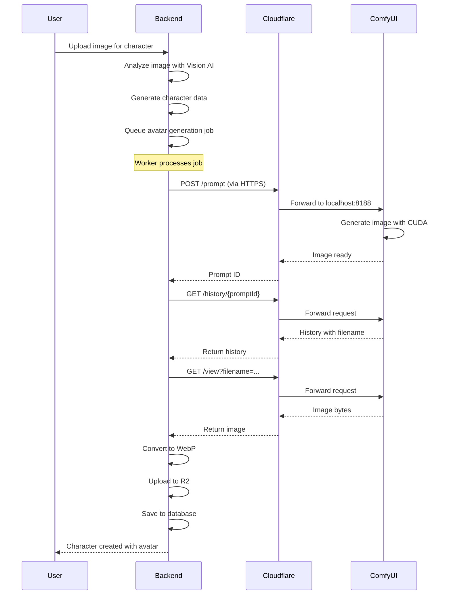

# ComfyUI Setup com Cloudflare Tunnel

Este documento descreve a configuração do ComfyUI para geração de imagens no CharHub, utilizando Cloudflare Tunnel para expor o serviço localmente para desenvolvimento e produção.

## Arquitetura

```
┌─────────────────┐
│  CharHub Backend│
│   (Docker/WSL)  │
│                 │
│  COMFYUI_URL=   │
│  https://...    │
└────────┬────────┘
         │
         │ HTTPS
         ▼
┌─────────────────┐
│ Cloudflare      │
│ Tunnel          │
│ (cloudflared)   │
└────────┬────────┘
         │
         │ HTTP
         ▼
┌─────────────────┐
│ ComfyUI         │
│ Windows Native  │
│ localhost:8188  │
│                 │
│ RTX 3060 TI     │
│ CUDA 12.8       │
└─────────────────┘
```

## Por que essa arquitetura?

### 1. **Performance GPU**
- ComfyUI roda nativamente no Windows para máximo desempenho
- Acesso direto à GPU RTX 3060 TI sem overhead de virtualização
- CUDA 12.8 funciona melhor no Windows nativo

### 2. **Flexibilidade de Deployment**
- Mesmo endpoint funciona para dev e produção
- Backend em Docker/WSL acessa via HTTPS público
- Fácil migrar para servidor GPU dedicado no futuro

### 3. **Segurança e Monitoramento**
- Cloudflare fornece SSL/TLS automaticamente
- Logs centralizados
- Proteção DDoS nativa

## Configuração Atual

### Endpoint Público
```
https://comfyui.charhub.app
```

Este endpoint está configurado via Cloudflare Tunnel e:
- ✅ Funciona para desenvolvimento local (backend em Docker/WSL)
- ✅ Funciona para produção (backend em servidor remoto)
- ✅ SSL/TLS automático via Cloudflare
- ✅ Sem necessidade de expor porta 8188 diretamente

### Variáveis de Ambiente

**`.env`**:
```bash
# ComfyUI Image Generation
# Production-ready endpoint via Cloudflare Tunnel (works for dev and prod)
# Local endpoint: http://localhost:8188 (if running ComfyUI locally)
# Tunnel endpoint: https://comfyui.charhub.app (recommended)
COMFYUI_URL=https://comfyui.charhub.app
COMFYUI_SERVICE_TOKEN=
COMFYUI_TIMEOUT=300000
```

### Opções de Configuração

| Ambiente | URL Recomendada | Quando Usar |
|----------|-----------------|-------------|
| **Produção** | `https://comfyui.charhub.app` | Sempre (padrão atual) |
| **Dev (Docker/WSL)** | `https://comfyui.charhub.app` | Backend em container precisa acessar ComfyUI no Windows |
| **Dev (Native)** | `http://localhost:8188` | Apenas se backend e ComfyUI estão na mesma máquina sem Docker |

## Como Funciona

### 1. ComfyUI (Windows)
- Roda em `http://localhost:8188`
- Acesso direto à GPU RTX 3060 TI
- Processamento de workflows para geração de imagens

### 2. Cloudflare Tunnel (Windows)
- Conecta `localhost:8188` → `https://comfyui.charhub.app`
- Fornece SSL/TLS
- Torna o ComfyUI acessível pela internet de forma segura

### 3. Backend (Docker/WSL ou Servidor)
- Acessa `https://comfyui.charhub.app` via HTTPS
- Envia workflows de geração de imagens
- Recebe imagens geradas

## Fluxo de Geração de Imagem



## Requisitos

### Hardware
- GPU Nvidia RTX 3060 TI (ou superior)
- CUDA 12.8 instalado
- Mínimo 12GB VRAM (recomendado para modelos SDXL)

### Software
- **Windows**: ComfyUI + cloudflared + CUDA drivers
- **Backend**: Docker + WSL2 (ou servidor Linux remoto)

## Troubleshooting

### Backend não conecta ao ComfyUI

**Sintoma**: `ECONNREFUSED` ou timeout nos logs

**Soluções**:

1. **Verificar ComfyUI está rodando**:
   ```powershell
   # No Windows, verificar se ComfyUI está acessível
   curl http://localhost:8188
   ```

2. **Verificar Cloudflare Tunnel está ativo**:
   ```powershell
   # Deve estar rodando em processo separado
   cloudflared tunnel --config <caminho>/config.yml run
   ```

3. **Testar endpoint público**:
   ```bash
   curl https://comfyui.charhub.app
   ```

4. **Verificar variável de ambiente no backend**:
   ```bash
   docker compose exec backend env | grep COMFYUI_URL
   # Deve retornar: COMFYUI_URL=https://comfyui.charhub.app
   ```

### ComfyUI está lento

**Causas possíveis**:
- Modelo muito grande para 12GB VRAM
- Múltiplas gerações em paralelo
- GPU em uso por outro processo

**Soluções**:
- Ajustar concurrency do worker para 1 (já configurado)
- Monitorar uso de VRAM: `nvidia-smi`
- Usar modelos otimizados para RTX 3060

### Cloudflare Tunnel desconecta

**Sintoma**: Tunnel para de funcionar periodicamente

**Soluções**:
- Configurar cloudflared como serviço do Windows
- Verificar logs: `cloudflared tunnel --config <config> run --loglevel debug`
- Atualizar cloudflared para versão mais recente

## Futuro: Migração para Servidor GPU Dedicado

Quando migrar para servidor GPU dedicado:

1. **Instalar ComfyUI no servidor**
2. **Configurar novo túnel Cloudflare** (ou usar mesmo)
3. **Atualizar DNS** se necessário
4. **Não precisa mudar código do backend** - apenas a variável `COMFYUI_URL`

Exemplo:
```bash
# .env no servidor GPU
COMFYUI_URL=https://comfyui.charhub.app  # Mesmo endpoint!
```

## Segurança

### Autenticação (Opcional)

Para adicionar autenticação por token:

1. **Gerar token secreto**:
   ```bash
   openssl rand -hex 32
   ```

2. **Configurar no .env**:
   ```bash
   COMFYUI_SERVICE_TOKEN=seu_token_aqui
   ```

3. **O backend já está preparado**: O `ComfyUIService` automaticamente adiciona header `Authorization: Bearer <token>` se o token estiver configurado.

> **Nota**: ComfyUI vanilla não suporta autenticação nativa. Para usar tokens, você precisaria adicionar um middleware customizado ou usar um proxy reverso com autenticação (Nginx, Caddy, etc).

### Cloudflare Access (Avançado)

Para proteção adicional, pode-se configurar Cloudflare Access para exigir autenticação adicional no túnel.

## Monitoramento

### Logs do Backend
```bash
# Ver logs de geração de imagem
docker compose logs backend | grep -E "ComfyUI|avatar_generation|image_generation"
```

### Logs do ComfyUI
- Interface web: `http://localhost:8188` (no Windows)
- Console do processo Python

### Logs do Cloudflare Tunnel
```powershell
# Windows PowerShell
cloudflared tunnel --config <config> run --loglevel info
```

## Referências

- [ComfyUI GitHub](https://github.com/comfyanonymous/ComfyUI)
- [Cloudflare Tunnel Docs](https://developers.cloudflare.com/cloudflare-one/connections/connect-apps/)
- [CUDA 12.8 Release Notes](https://docs.nvidia.com/cuda/cuda-toolkit-release-notes/)
