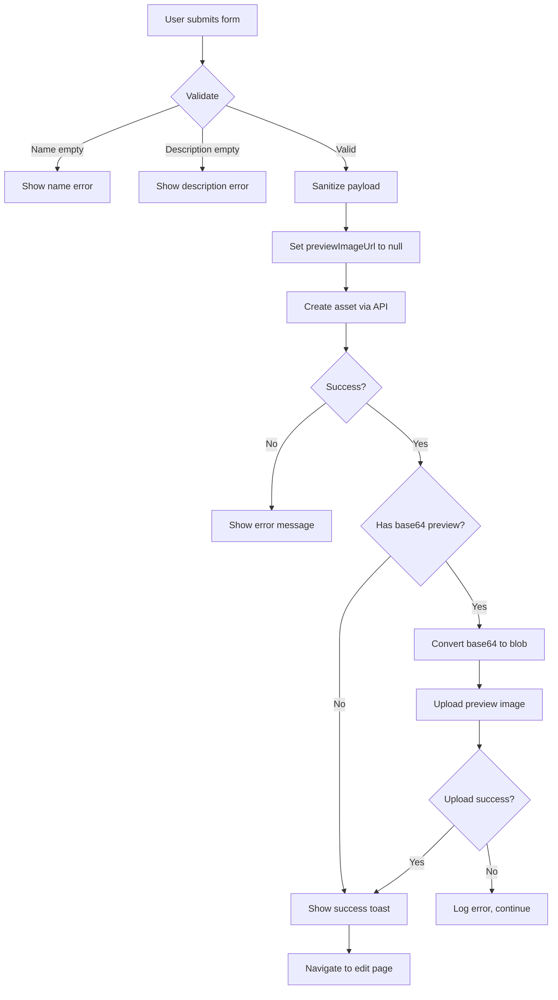

# Asset Create Page

**Purpose**: Form for creating new assets.

**Location**: `frontend/src/pages/assets/create/index.tsx`

**Route**: `/assets/create`

---

## Overview

The Asset Create page provides a comprehensive form for creating new assets. It handles form validation, base64 image processing (for preview images), and redirects to the edit page after successful creation.

---

## Features

### Form Validation

**Required Fields**:
- `name` - Asset name (validated on submit)
- `description` - Asset description (validated on submit)

**Validation Flow**:
1. User submits form
2. Name checked for non-empty after trim
3. Description checked for non-empty after trim
4. Errors displayed inline if validation fails

### Image Handling

**Preview Image Upload**:
- Supports base64 data URLs from image uploaders
- Two-stage upload process:
  1. Asset created with `previewImageUrl: null`
  2. If base64 preview exists, convert to blob and upload after creation
- Base64 to blob conversion:
  - Extract base64 data
  - Convert to byte array
  - Create Blob with WebP MIME type
  - Upload via `assetService.uploadImage`

**Error Handling**:
- Upload errors logged but don't block asset creation
- Asset created successfully even if preview upload fails

### Form State

**Form Management** (`useAssetForm` hook):
- Initializes with `EMPTY_ASSET_FORM`
- Tracks all form fields
- Provides `values` and update methods
- Handles complex nested state

**Submit State**:
- `isSubmitting` - Prevents double-submission
- Disables submit button during submission
- Shows loading indicator

**Error State**:
- `error` - Displays validation or creation errors
- Inline error message below form

### Navigation

**Success**:
- Toast notification: "Asset created successfully"
- Redirect to: `/assets/${assetId}/edit`
- Allows immediate further editing

**Cancel**:
- Navigate to: `/assets/hub`
- Discards unsaved changes

---

## i18n Keys Used

### Page
- `assets:form.create` - "Create Asset" (page title, submit button)

### Validation
- `assets:messages.nameRequired` - "Asset name is required"
- `assets:messages.descriptionRequired` - "Description is required"
- `assets:messages.errorCreating` - "Failed to create asset"
- `assets:messages.created` - "Asset created successfully" (toast)

### Buttons
- `common:cancel` - "Cancel" button

---

## Data Flow

### Submit Flow



### Image Upload Flow (After Creation)

1. Check if `form.values.previewImageUrl` starts with `data:`
2. Extract base64 data (after comma)
3. Convert base64 to byte characters
4. Create byte arrays in chunks of 512
5. Convert arrays to Uint8Array
6. Create Blob from byte arrays
7. Upload via `assetService.uploadImage` with:
   - `file`: The Blob
   - `assetId`: Created asset ID
   - `type`: 'PREVIEW'

---

## Component Structure

```tsx
export default function AssetCreatePage() {
  // State
  const [isSubmitting, setIsSubmitting] = useState(false);
  const [error, setError] = useState<string | null>(null);

  // Hooks
  const { t } = useTranslation(['assets', 'common']);
  const navigate = useNavigate();
  const { createMutation } = useAssetMutations();
  const { setTitle } = usePageHeader();
  const { addToast } = useToast();
  const form = useAssetForm({ initialValues: EMPTY_ASSET_FORM });

  // Effects
  useEffect(() => {
    setTitle(t('assets:form.create'));
  }, [setTitle, t]);

  // Handlers
  const handleSubmit = async (e: React.FormEvent) => {
    // Validation logic
    // Sanitize payload
    // Create asset
    // Handle preview image upload
    // Navigate to edit page
  };

  const handleCancel = () => {
    navigate('/assets/hub');
  };

  // Render
  return (
    <AssetFormLayout
      mode="create"
      assetName={form.values.name}
      form={form}
      error={error}
      isSubmitting={isSubmitting}
      onSubmit={handleSubmit}
      onCancel={handleCancel}
      submitLabel={t('assets:form.create')}
      cancelLabel={t('common:cancel')}
    />
  );
}
```

---

## Props Passed to AssetFormLayout

| Prop | Type | Description |
|------|------|-------------|
| `mode` | `'create'` | Form mode for conditional rendering |
| `assetName` | `string \| undefined` | Current asset name for header |
| `form` | `UseFormReturn<AssetFormValues>` | Form state and handlers |
| `error` | `string \| null` | Error message to display |
| `isSubmitting` | `boolean` | Whether form is currently submitting |
| `onSubmit` | `(e: React.FormEvent) => void` | Submit handler |
| `onCancel` | `() => void` | Cancel handler |
| `submitLabel` | `string` | Submit button text |
| `cancelLabel` | `string` | Cancel button text |

---

## Edge Cases

### Large Base64 Images

**Problem**: Base64 images can be very large (several MB).

**Solution**:
- Sanitize payload to remove base64 before creation
- Upload preview separately after getting assetId
- Upload errors don't block asset creation

### Form State Loss

**Problem**: User might accidentally navigate away.

**Current Behavior**:
- No prompt on navigation
- Form state lost on navigation
- User must re-enter data

**Future Enhancement**:
- Add unsaved changes warning
- Implement form state persistence

### Network Errors

**Problem**: Creation or upload might fail.

**Current Handling**:
- Show error message inline
- Log errors to console
- Allow retry after fixing errors
- Toast notification on success

---

## Dependencies

### Components
- `AssetFormLayout` - Shared form layout component

### Hooks
- `useAssetForm` - Form state management
- `useAssetMutations` - Create mutation
- `usePageHeader` - Page title management
- `useToast` - Toast notifications
- `useTranslation` - i18n translations

### Services
- `assetService` - Image upload service

### Types
- `AssetFormValues` - Form data structure
- `EMPTY_ASSET_FORM` - Default form values

---

## Related

- `frontend/src/pages/assets/hub/index.docs.md` - Assets hub page
- `frontend/src/pages/assets/shared/components/AssetFormLayout.docs.md` - Form layout component
- `frontend/src/pages/assets/shared/hooks/useAssetForm.docs.md` - Form hook
- `frontend/src/pages/assets/shared/hooks/useAssetQueries.docs.md` - Asset queries
- `backend/src/routes/v1/assets.docs.md` - Asset creation API
