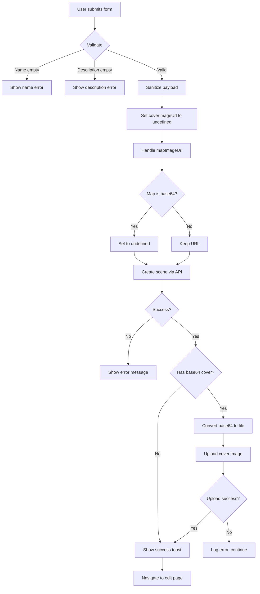

# Scene Create Page

**Purpose**: Form for creating new scenes.

**Location**: `frontend/src/pages/scenes/create/index.tsx`

**Route**: `/scenes/create`

---

## Overview

The Scene Create page provides a comprehensive form for creating new scenes. It handles form validation, base64 image processing (for cover and map images), and redirects to the edit page after successful creation.

---

## Features

### Form Validation

**Required Fields**:
- `name` - Scene name (validated on submit)
- `description` - Scene description (validated on submit)

**Validation Flow**:
1. User submits form
2. Name checked for non-empty after trim
3. Description checked for non-empty after trim
4. Errors displayed inline if validation fails

### Image Handling

**Cover Image Upload**:
- Supports base64 data URLs from image uploaders
- Two-stage upload process:
  1. Scene created with `coverImageUrl: undefined`
  2. If base64 cover exists, convert to file and upload after creation
- Base64 to file conversion:
  - Extract base64 data
  - Convert to byte array
  - Create Blob with WebP MIME type
  - Create File object with proper filename
  - Upload via `sceneService.uploadCover`

**Map Image Upload**:
- Similar two-stage process
- Map image can be URL (left as-is) or base64 (uploaded after creation)
- Base64 map images uploaded separately from cover image

**Error Handling**:
- Upload errors logged but don't block scene creation
- Scene created successfully even if image upload fails

### Form State

**Form Management** (`useSceneForm` hook):
- Initializes with `EMPTY_SCENE_FORM`
- Tracks all form fields
- Provides `values` and update methods
- Handles complex nested state

**Submit State**:
- `isSubmitting` - Prevents double-submission
- Disables submit button during submission
- Shows loading indicator

**Error State**:
- `error` - Displays validation or creation errors
- Inline error message below form

### Navigation

**Success**:
- Toast notification: "Scene created successfully"
- Redirect to: `/scenes/${sceneId}/edit`
- Allows immediate further editing

**Cancel**:
- Navigate to: `/scenes/hub`
- Discards unsaved changes

---

## i18n Keys Used

### Page
- `scenes:form.create` - "Create Scene" (page title, submit button)

### Validation
- `scenes:messages.nameRequired` - "Scene name is required"
- `scenes:messages.descriptionRequired` - "Description is required"
- `scenes:messages.errorCreating` - "Failed to create scene"
- `scenes:messages.created` - "Scene created successfully" (toast)

### Buttons
- `common:cancel` - "Cancel" button

---

## Data Flow

### Submit Flow



### Cover Image Upload Flow (After Creation)

1. Check if `form.values.coverImageUrl` starts with `data:`
2. Extract base64 data (after comma)
3. Convert base64 to byte characters
4. Create byte arrays in chunks of 512
5. Convert arrays to Uint8Array
6. Create Blob from byte arrays
7. Create File object:
   - Name: `scene-cover.webp`
   - Type: `image/webp`
8. Upload via `sceneService.uploadCover` with:
   - `file`: The File object
   - `sceneId`: Created scene ID

---

## Component Structure

```tsx
export default function SceneCreatePage() {
  // State
  const [isSubmitting, setIsSubmitting] = useState(false);
  const [error, setError] = useState<string | null>(null);

  // Hooks
  const { t } = useTranslation(['scenes', 'common']);
  const navigate = useNavigate();
  const { createMutation } = useSceneMutations();
  const { setTitle } = usePageHeader();
  const { addToast } = useToast();
  const form = useSceneForm({ initialValues: EMPTY_SCENE_FORM });

  // Effects
  useEffect(() => {
    setTitle(t('scenes:form.create'));
  }, [setTitle, t]);

  // Handlers
  const handleSubmit = async (e: React.FormEvent) => {
    // Validation logic
    // Sanitize payload
    // Create scene
    // Handle cover image upload
    // Navigate to edit page
  };

  const handleCancel = () => {
    navigate('/scenes/hub');
  };

  // Render
  return (
    <SceneFormLayout
      mode="create"
      sceneName={form.values.name}
      form={form}
      error={error}
      isSubmitting={isSubmitting}
      onSubmit={handleSubmit}
      onCancel={handleCancel}
      submitLabel={t('scenes:form.create')}
      cancelLabel={t('common:cancel')}
    />
  );
}
```

---

## Props Passed to SceneFormLayout

| Prop | Type | Description |
|------|------|-------------|
| `mode` | `'create'` | Form mode for conditional rendering |
| `sceneName` | `string \| undefined` | Current scene name for header |
| `form` | `UseFormReturn<SceneFormValues>` | Form state and handlers |
| `error` | `string \| null` | Error message to display |
| `isSubmitting` | `boolean` | Whether form is currently submitting |
| `onSubmit` | `(e: React.FormEvent) => void` | Submit handler |
| `onCancel` | `() => void` | Cancel handler |
| `submitLabel` | `string` | Submit button text |
| `cancelLabel` | `string` | Cancel button text |

---

## Edge Cases

### Large Base64 Images

**Problem**: Base64 images can be very large (several MB).

**Solution**:
- Sanitize payload to remove base64 before creation
- Upload images separately after getting sceneId
- Upload errors don't block scene creation

### Map Image Handling

**Problem**: Map image might be URL or base64.

**Current Handling**:
- URLs passed through unchanged
- Base64 images sanitized (set to undefined)
- Separate upload not implemented for map (only cover)

### Form State Loss

**Problem**: User might accidentally navigate away.

**Current Behavior**:
- No prompt on navigation
- Form state lost on navigation
- User must re-enter data

**Future Enhancement**:
- Add unsaved changes warning
- Implement form state persistence

### Network Errors

**Problem**: Creation or upload might fail.

**Current Handling**:
- Show error message inline
- Log errors to console
- Allow retry after fixing errors
- Toast notification on success

---

## Differences from Asset Create Page

| Feature | Asset Create | Scene Create |
|---------|--------------|--------------|
| Cover Image | `previewImageUrl` | `coverImageUrl` |
| Secondary Image | None | `mapImageUrl` |
| Image Service | `assetService.uploadImage` | `sceneService.uploadCover` |
| File Object | Blob | File (with filename) |
| Secondary Upload | Not applicable | Not implemented for map |

---

## Dependencies

### Components
- `SceneFormLayout` - Shared form layout component

### Hooks
- `useSceneForm` - Form state management
- `useSceneMutations` - Create mutation
- `usePageHeader` - Page title management
- `useToast` - Toast notifications
- `useTranslation` - i18n translations

### Services
- `sceneService` - Cover upload service

### Types
- `SceneFormValues` - Form data structure
- `EMPTY_SCENE_FORM` - Default form values

---

## Related

- `frontend/src/pages/scenes/hub/index.docs.md` - Scenes hub page
- `frontend/src/pages/scenes/shared/components/SceneFormLayout.docs.md` - Form layout component
- `frontend/src/pages/scenes/shared/hooks/useSceneForm.docs.md` - Form hook
- `frontend/src/pages/scenes/shared/hooks/useSceneQueries.docs.md` - Scene queries
- `backend/src/routes/v1/scenes.docs.md` - Scene creation API
